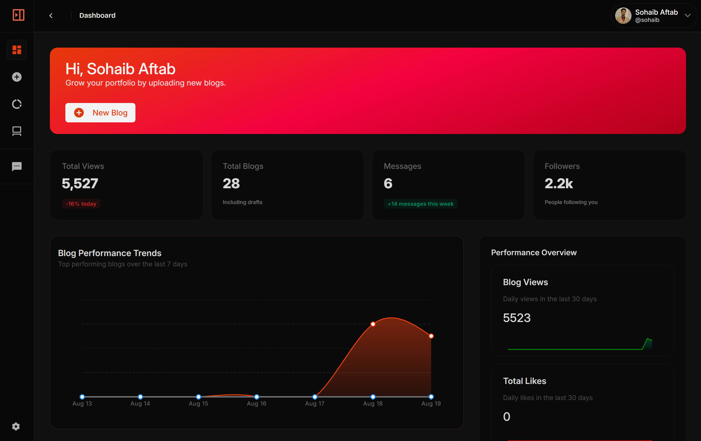

# Headless CMS Frontend


> **A modern, production-ready Headless CMS frontend for blogs and content management.**

---

## 🚀 Overview

This project is a fully functional, visually stunning headless CMS frontend built with ReactJS. It empowers creators and teams to manage blog content with zero backend setup, lightning-fast integration, and a beautiful dashboard experience.

---

## 📸 Demo



> **Live Demo:** [Coming Soon]

---

## 📋 Table of Contents

- [Overview](#overview)
- [Demo](#demo)
- [Features](#features)
- [Tech Stack](#tech-stack)
- [Installation](#installation)
- [Usage](#usage)
- [Available Scripts](#available-scripts)
- [Dependencies](#dependencies)
- [Contributing](#contributing)
- [License](#license)

---

## ✨ Features

- **Zero Backend Setup:** Just install and manage content instantly.
- **Lightning Fast:** Low-code, plug-and-play components.
- **All-in-One:** Blogs, messages, testimonials, and more.
- **Beautiful UI:** Modern glassmorphism, responsive design, and glowing grid effects.
- **Production-Ready Components:** SEO, analytics, forms, and dashboards.
- **Dark/Light Theme Support**
- **Easy Integration:** Works with any website.

---

## 🛠 Tech Stack

- **React 18**
- **React Router**
- **Remix Icon**
- **MUI (Material UI)**
- **Jodit Rich Text Editor**
- **Custom CSS Animations & Glassmorphism**

---

## ⚡ Installation

Clone and install dependencies:

```sh
git clone https://github.com/HattySohaib/Headless-CMS-Frontend.git
cd Headless-CMS-Frontend
npm install
```

---

## ▶️ Usage

Start the development server:

```sh
npm start
```

Open [http://localhost:3000](http://localhost:3000) in your browser.

---

## 📦 Available Scripts

- `npm start` — Run in development mode
- `npm test` — Launch test runner
- `npm run build` — Build for production
- `npm run eject` — Eject configuration

---

## 📚 Dependencies

> See `package.json` for full details.

- **@emotion/react**
- **@emotion/styled**
- **@mui/material**
- **@mui/x-charts**
- **@remixicon/react**
- **@testing-library/jest-dom**
- **@testing-library/react**
- **@testing-library/user-event**
- **class-variance-authority**
- **clsx**
- **react**
- **react-dom**
- **react-router-dom**
- **react-scripts**
- **react-toastify**
- **web-vitals**

---

## 🤝 Contributing

Pull requests, issues, and suggestions are welcome! For major changes, please open an issue first to discuss what you would like to change.

---

## 📬 Contact

- **Author:** Hatty Sohaib ([LinkedIn](https://www.linkedin.com/in/hattysohaib/))
- **Email:** hattysohaib@gmail.com

---

## 📄 License

This project is licensed under the ISC License.
